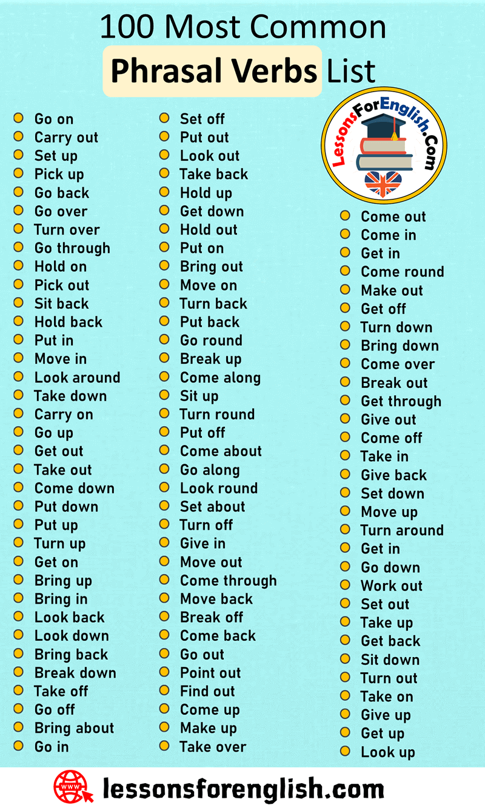
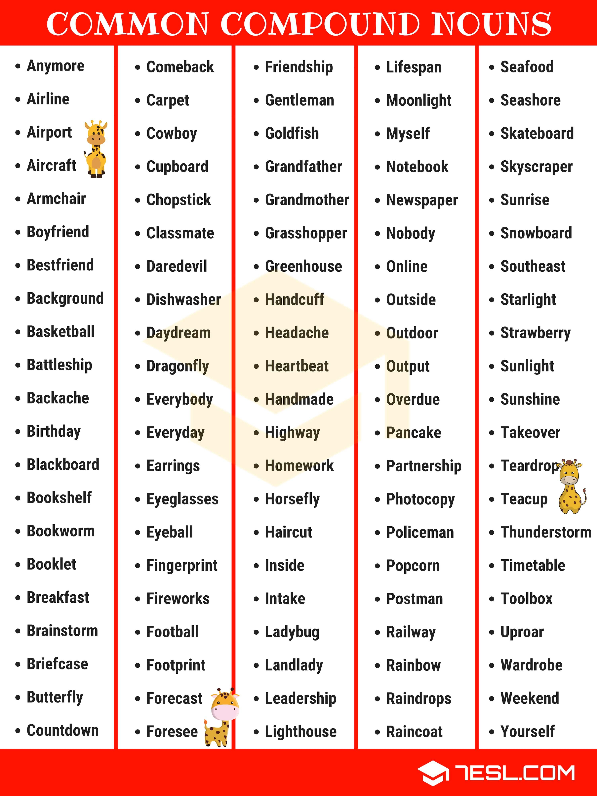

# English

## Notes

### Phrasal verbs

Phrasal verb is the **combination of two or three words** from **different grammatical categories** — a verb and a particle. e.g. `turn down`, `sit up` or `went out`.

Common phrasal verbs

  

### Compound nouns

This is a nouns made up of two or more existing words, e.g. `everyday` or `basketball`.

Common compound nouns

  

## Links
